# Wearable Ring Mouse

## Introduction
In the world of modern computing, the need for more intuitive and portable computer input devices has become increasingly pronounced. The traditional computer mouse, while a reliable tool for navigating digital landscapes, comes with inherent limitations that impact the user experience. This project introduces a wearable ring mouse that addresses these limitations, offering a new level of convenience and accessibility.

## Problem Statement
Using One Hand for the Mouse?
Can a Person Who Can Only Use Their Fingers Operate the Mouse?
Do We Need a Table to Use This Mouse?
## Wearable Mouse Solution
This wearable mouse allows users to control the cursor by moving just one finger and perform right-click and left-click actions using the same finger. By using two fingers, users can move the cursor, eliminating the need for a table to operate the mouse. With this wearable mouse, users can control the cursor without moving the entire hand.

## Images

  
3d model and working way

  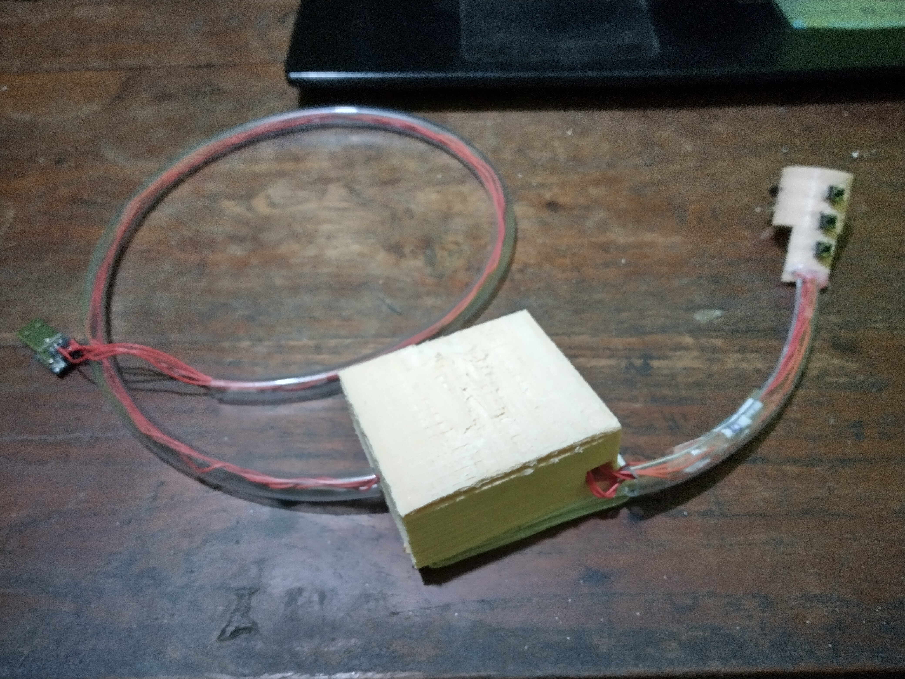
  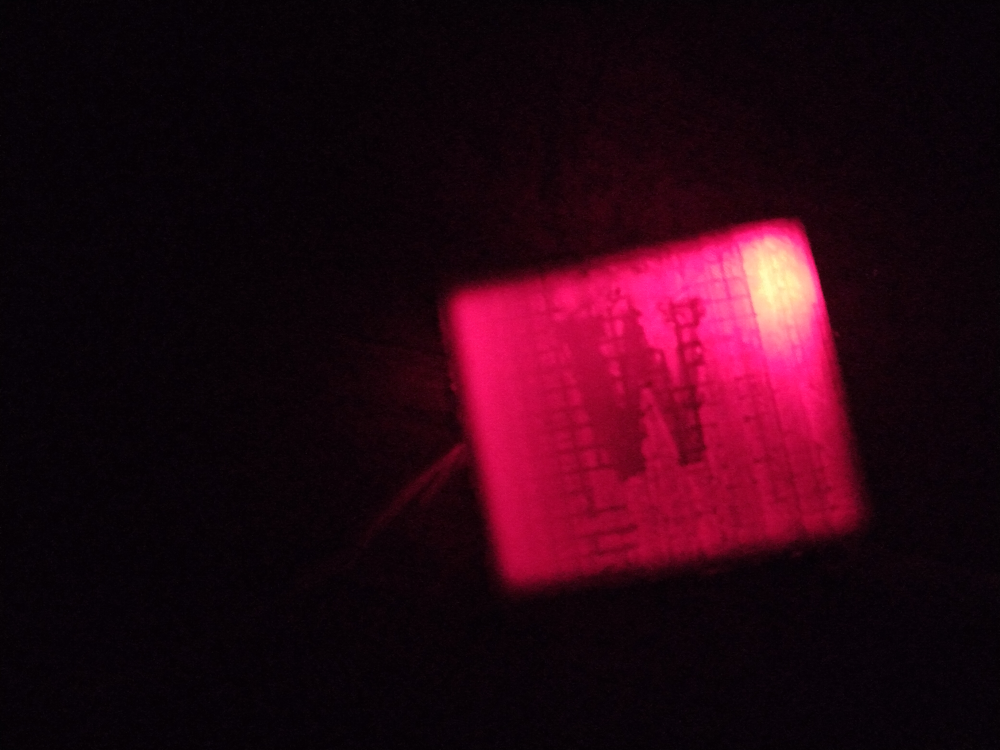
  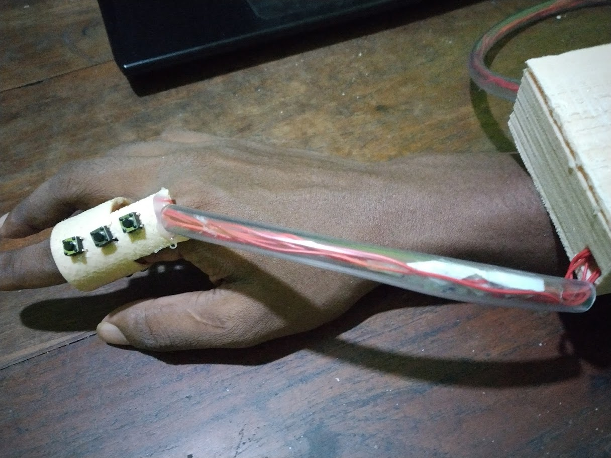

  
Developing images

  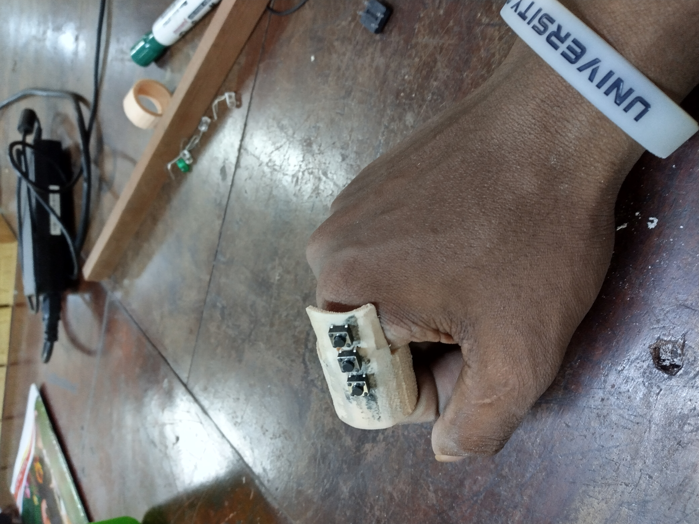
  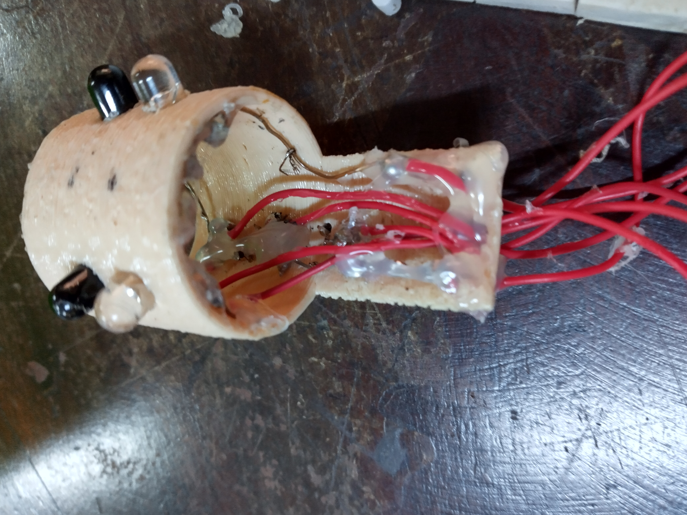
  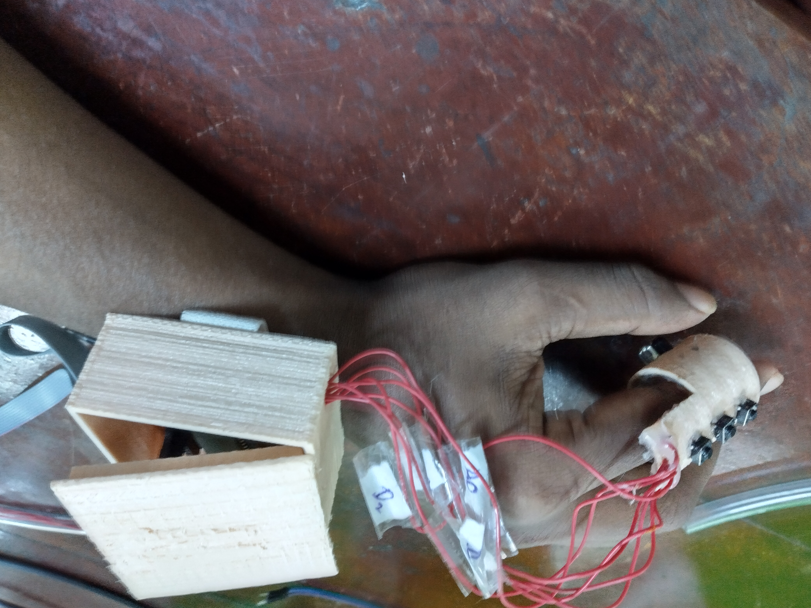
  

  
circuit

    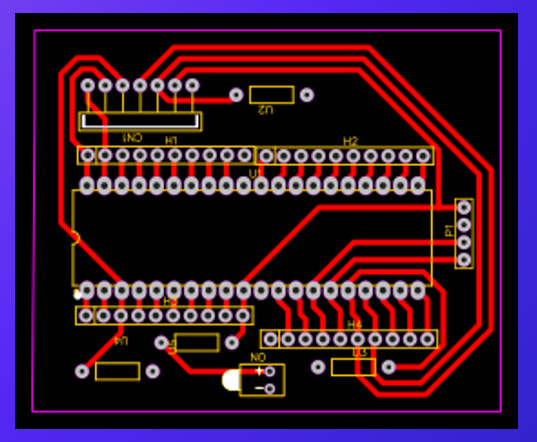
  

  
3D model

    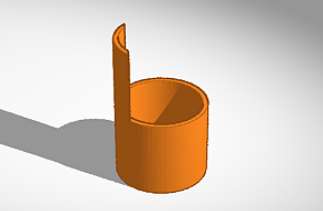
    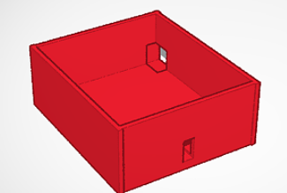
    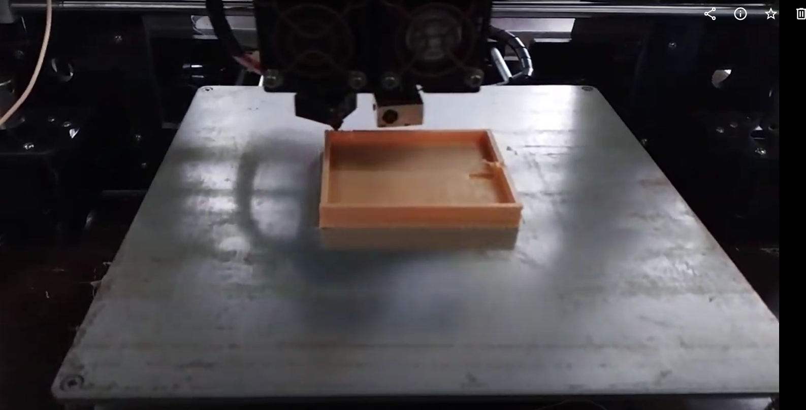
    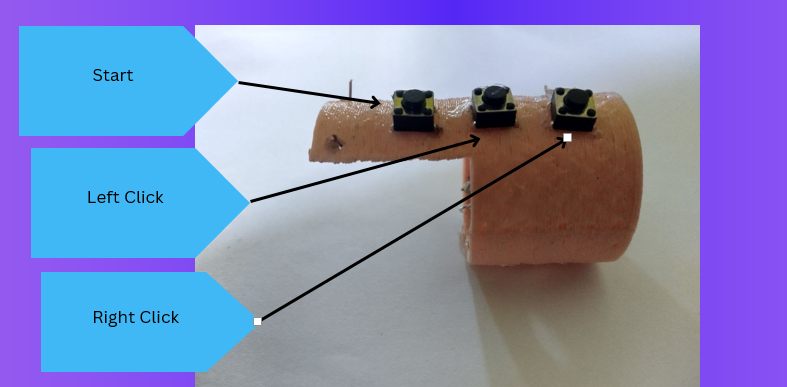
  

## How It Works

### Data Flow
Get Data: The ring collects movement data.
Microcontroller: The ATmega32 processes this data.
Send Data: The processed data is sent to the computer for cursor control.

### Measurements
X and Y Axis: The ring measures the X and Y-axis movements to control the cursor on the computer screen.
Functionalities
Cursor Movement: Capturing X and Y-axis data for cursor movement.
Start Button: Activating the mouse functionality.
Left-Click Button: Executing a left-click action.
Right-Click Button: Executing a right-click action.

### Components
ATmega32 Microcontroller
The ATmega32 microcontroller is selected for its cost-effectiveness, low power consumption, and ease of programming. It is the core component that processes data from the sensors and facilitates communication with the computer.

Push Buttons
Push buttons are used as interrupt triggers for the left-click, right-click, and start functions.

UART Serial Adaptor Module
The UART (Universal Asynchronous Receiver-Transmitter) facilitates communication between the computer and the microcontroller, enabling seamless data transfer.

IR LED and Photodiode
An IR LED and photodiode are integrated for distance measurement, offering a cost-effective and easy-to-implement solution compatible with the ring's design.

Circuit Diagram

### Process
Data Acquisition: The ATmega32 microcontroller reads data from the photodiode, using its ADC (Analog-to-Digital Converter) to convert analog signals into digital data.

Data Processing: The microcontroller processes the captured data and prepares it for transmission to the computer.

Communication: The ATmega32's TX pin connects to the UART's RX pin to send data to the computer. The RX pin connects to the UART's TX pin for two-way communication.

Python Integration: Python is used to capture serial data and translate it into real-time cursor movement using the following modules:

Serial Module
PyAutoGUI Module
Time Module
By leveraging these Python modules, the wearable device data is seamlessly transformed into cursor movements on the computer screen, providing a smooth user experience.

### Challenges
Finding the Perfect Sensor: Identifying a suitable sensor for accurate finger movement detection.
Dealing with Long Wire Connections: Managing the complexity of long wire connections within the wearable device.
Integrating Components into the Ring: Ensuring all components fit comfortably within the ring design.
Components Used
ATmega32 Microcontroller
IR LED Bulbs
Push Buttons
USB-to-Serial Converter
3D Printed Models
Conclusion
This project offers a portable and intuitive solution for computer input, allowing users to navigate digital spaces with ease, even with limited hand mobility. The wearable ring mouse is a step forward in making technology more accessible and user-friendly.
